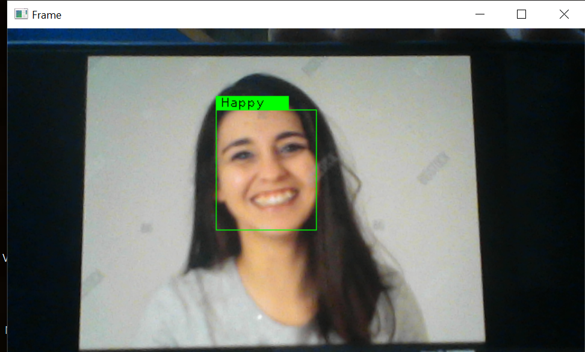
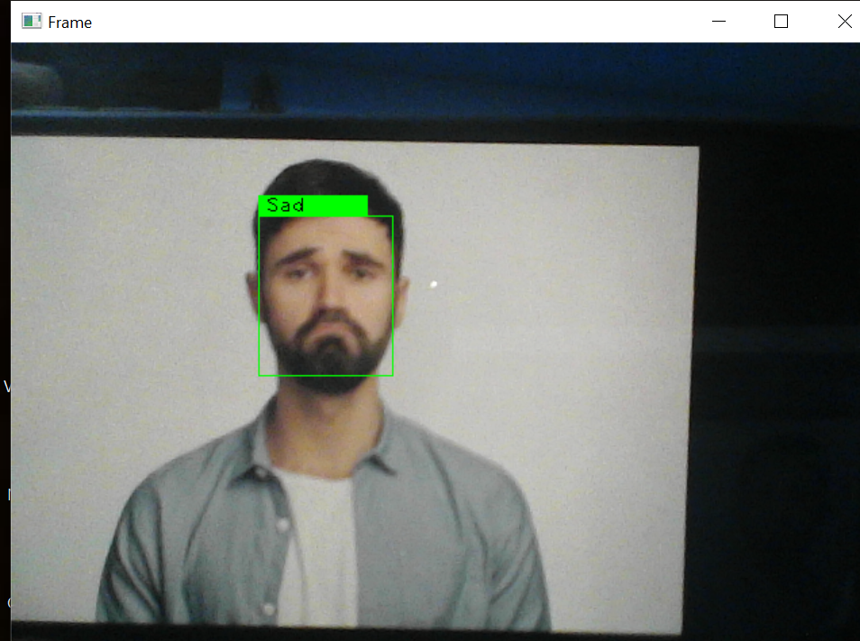
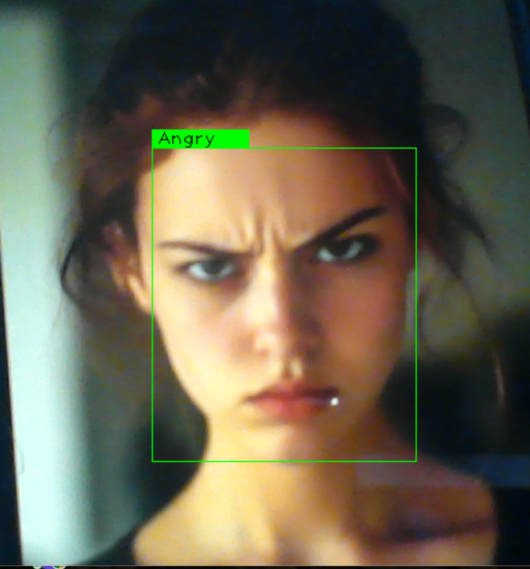
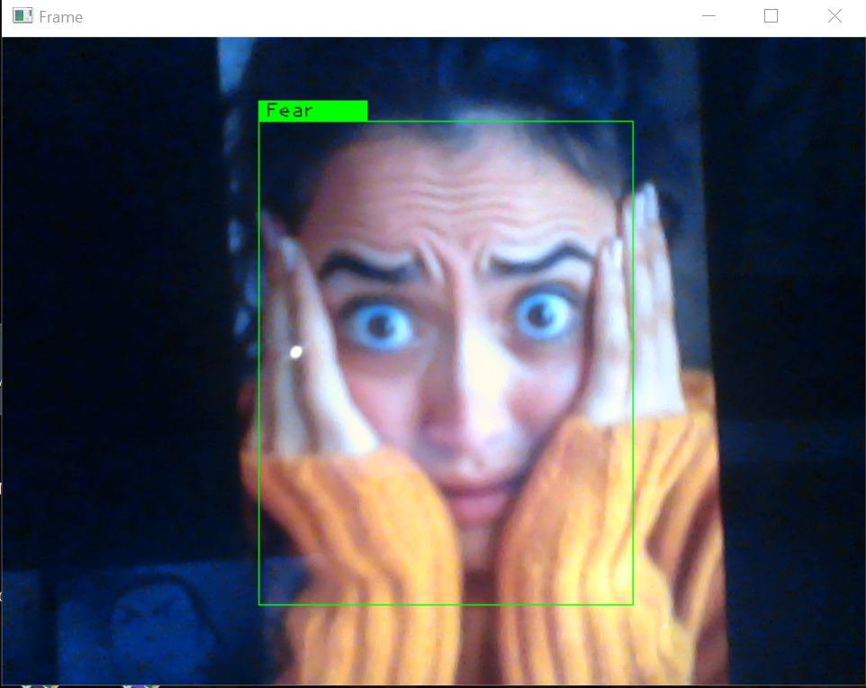
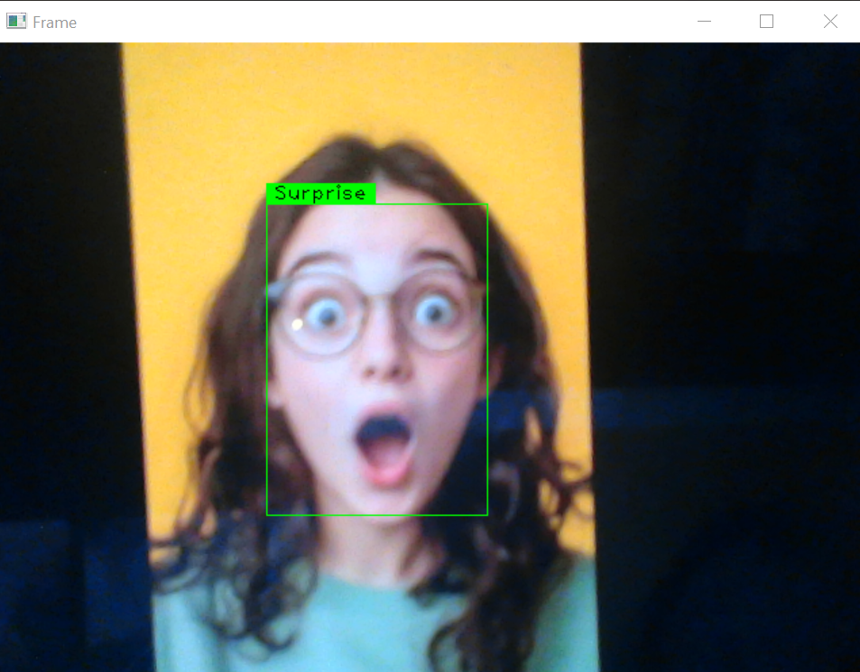
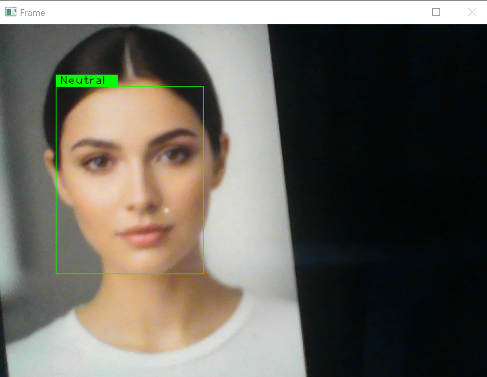

# 🤖 Emotion Detection System
An AI-powered system that detects human emotions in real-time using facial expressions.
---

## 🚀 Features
- Real-time face detection using webcam
- Predicts emotions: Happy, Sad, Angry, Surprise, Fear, Disgust, Neutral
- Built with deep learning using TensorFlow/Keras

---

## 🛠️ Tech Stack
- Python
- OpenCV
- TensorFlow / Keras
- NumPy

---

## 📦 Installation & Usage
```bash
git clone https://github.com/Bhuvana-1106/emotion-detector.git
cd emotion-detector
pip install -r requirements.txt
python detect_emotion.py
```

---

## 📁 Project Structure

emotion-detector/
├── detect_emotion.py
├── haarcascade_frontalface_default.xml
├── requirements.txt
└── model/
└── emotion_model.hdf5

---

## 📸 Output  

### 😊 Happy  
  

### 😢 Sad  
  

### 😠 Angry  
  

### 😨 Fear  
  

### 😮 Surprise  
  

### 😐 Neutral  
  

---

## ⚙️ How It Works  
1. Captures real-time video using webcam  
2. Detects face using Haar Cascade classifier  
3. Converts face to grayscale and resizes it  
4. Passes image to trained deep learning model  
5. Predicts emotion and displays result

---

## ⚠️ Challenges Faced  
- Handling real-time video processing  
- Improving model accuracy  
- Integrating OpenCV with deep learning model

---

## 💡 Future Improvements
- Improve model accuracy
- Add web version using Flask
- Deploy online

---

## 👩‍💻 Author
**Bhuvaneshwari.M** - [GitHub](https://github.com/Bhuvana-1106)
